# 🧪 Mind Influence Lab

**A Scientific Experiment Tool for Consciousness Studies**

---

## 📖 About

Mind Influence Lab is an experimental mobile research platform designed for individuals interested in exploring the relationship between consciousness and physical reality through controlled experiments.

Inspired by the **Princeton Engineering Anomalies Research (PEAR) Lab** methodology, this app combines:

- 🔮 **System Entropy-Based Random Number Generator (RNG)** - Test for statistical deviations
- 🧲 **Magnetometer Sensor** - Monitor environmental magnetic fields
- 📊 **Accelerometer** - Track movement and stillness quality
- 🧘 **Focus Calibration** - Binaural beats for meditation training
- 📈 **Research Analytics** - Track patterns across sessions

---

## 🎯 Features

### Experiment Lab
- Real-time RNG deviation tracking
- Live magnetic field monitoring
- 60-second calibration baseline
- Movement detection for data quality
- Session coherence scoring (0-100)

### Focus Calibration
- Alpha wave binaural beats (10Hz)
- Breathing animation guide
- Session timer
- Distraction-free interface

### Research Journey
- Session history with full data
- Aggregate insights and statistics
- Export data as CSV
- Track progress over time

### Researcher Profile
- XP and level progression
- Achievement badges
- Streak tracking
- Gamified motivation

---

## 📥 Download

| Version | Release Date | Size | Download |
| :--- | :--- | :--- | :--- |
| **v1.0.0** | February 2026 | ~25 MB | [Download APK](https://github.com/WickedDarko/mind-influence-lab/releases/latest) |

**Requirements:**
- Android 8.0 or higher
- Magnetometer sensor (most phones have this)
- Storage permission for data export

---

## 🖼️ Screenshots

### App Interface

| | | |
| :---: | :---: | :---: |
| 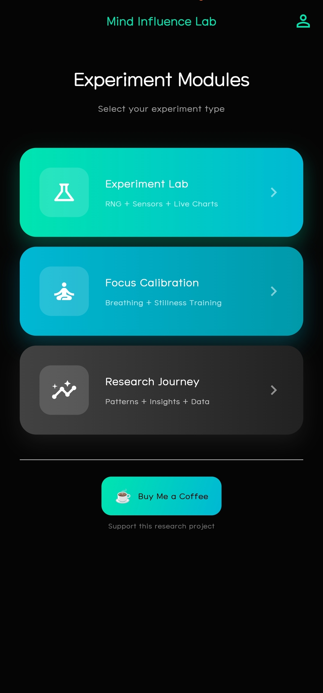 | 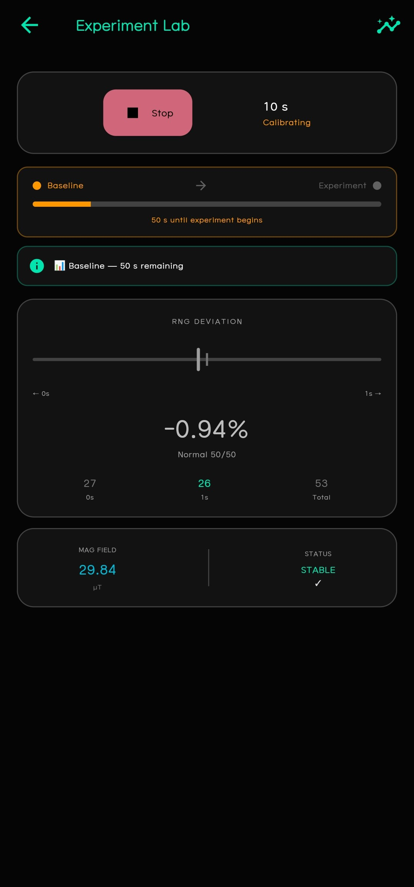 | 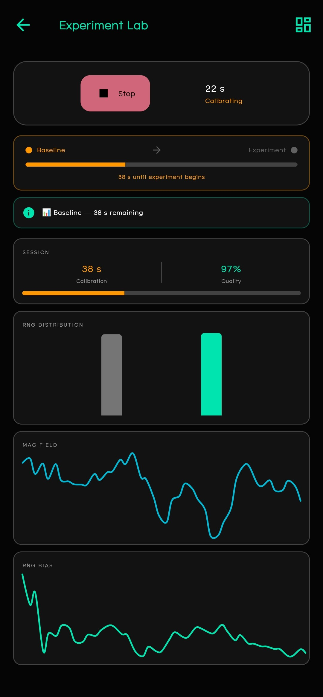 |
| *Home Screen* | *Experiment Dashboard* | *Experiment Data View* |
| 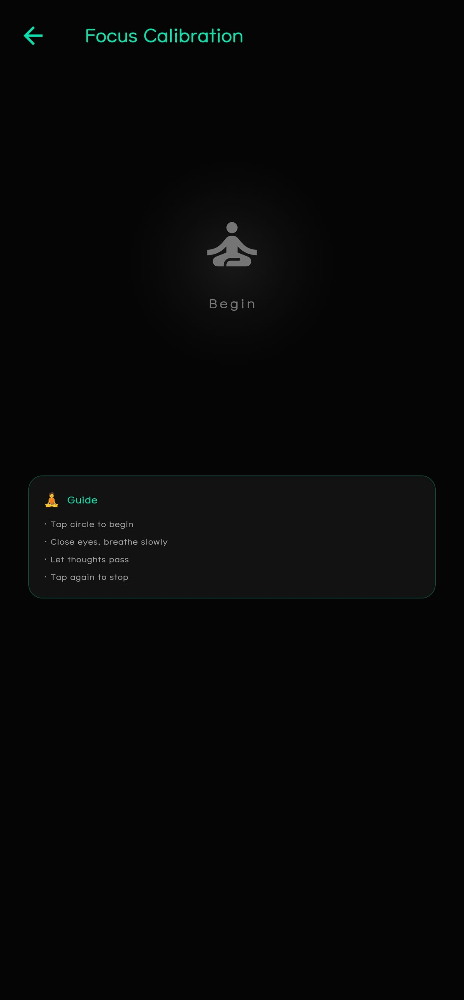 | 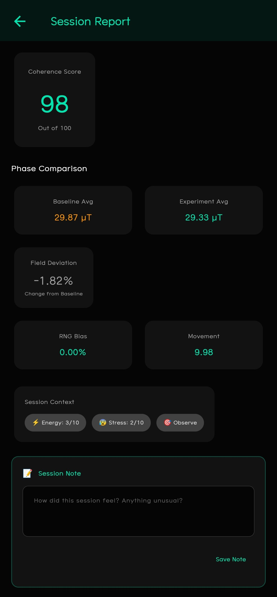 | 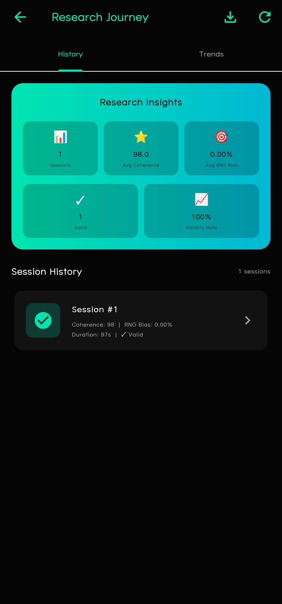 |
| *Focus Calibration* | *Session Results* | *Research Journey* |
| 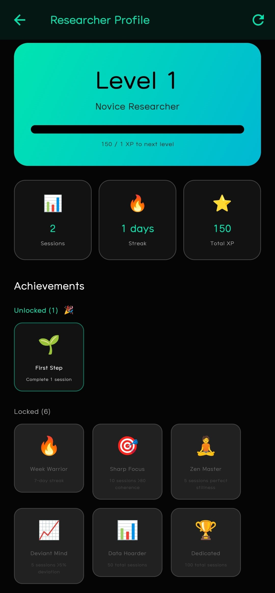 | | |
| *Researcher Profile* | | |

### Onboarding Experience

| | | |
| :---: | :---: | :---: |
| 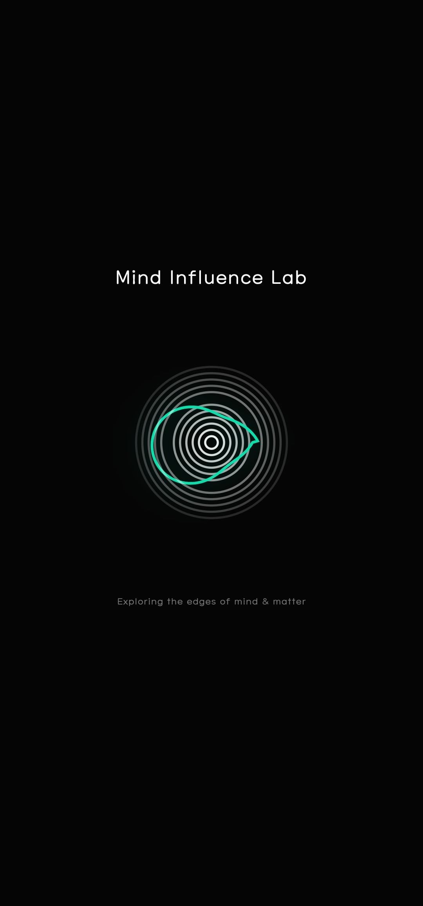 | 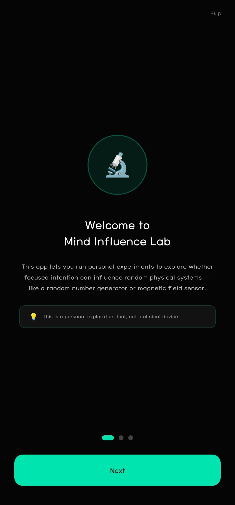 | 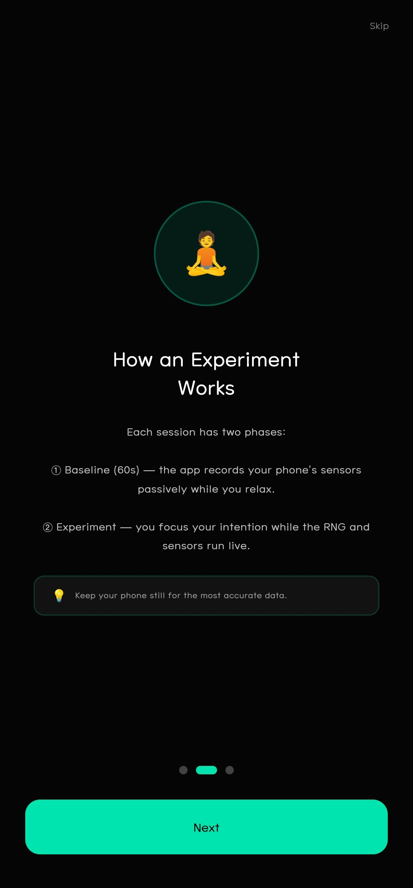 |
| *Splash Screen* | *Welcome* | *How Experiment Works* |
| 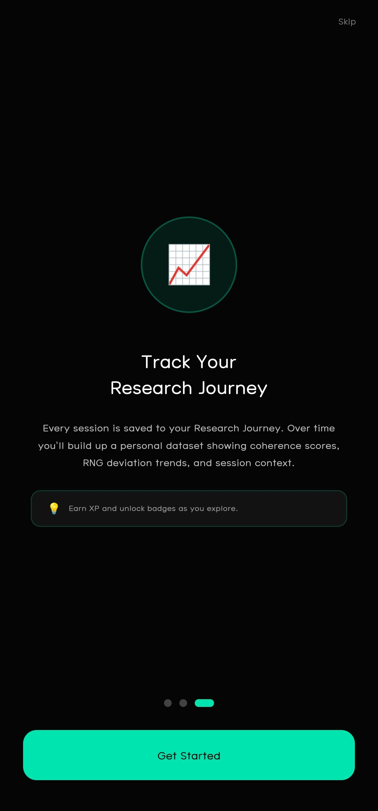 | | |
| *Track Your Journey* | | |
---

## 🔒 Privacy & Data

| What We Collect | What We Don't Collect |
| :--- | :--- |
| ✅ Sensor data (local only) | ❌ No personal information |
| ✅ Session data (stored on device) | ❌ No location data |
| ✅ User-added notes | ❌ No contact information |
| | ❌ No data sold to third parties |

**All data is stored locally on your device.** Export/sharing is entirely optional and under your control.

[View Full Privacy Policy](PRIVACY_POLICY.md)

---

## 🧪 Scientific Disclaimer

**Mind Influence Lab is an EXPERIMENT TOOL, not a medical device.**

### RNG Methodology (v1.0)

This app uses Android's **cryptographically secure random number generator** (`Random.secure()`), which is seeded by **system entropy sources** including:

- Sensor noise (magnetometer, accelerometer)
- CPU timing variations
- User interaction timing
- System event timing

**Important Notes:**
- This is **not a dedicated hardware RNG** (like quantum or thermal noise devices)
- Suitable for **exploratory consciousness research** and personal experimentation
- Results may vary; multiple sessions are needed to identify patterns
- This app does not diagnose or treat any condition

### A Note on Scientific Status

The hypothesis that consciousness may influence random systems is **not established science**. 
This app is designed for **personal exploration and data collection**, not as a validated 
measurement tool. 

Users should:
- Maintain scientific skepticism
- Not make important decisions based on session results
- Understand that apparent patterns may be coincidence
- Recognize that this research area is controversial and not universally accepted

This app is best used as a **experiment tool with scientific curiosity**, not as proof of 
consciousness affecting reality. Multiple sessions, careful documentation, and 
independent analysis are recommended for anyone pursuing this as research.

---

## 🐛 Bug Reports & Feedback

Found a bug? Have a suggestion? Want to share your research findings?

- 📧 **Email:** [debunking3am.thoughts@gmail.com]
- 🐛 **Issues:** [GitHub Issues](https://github.com/WickedDarko/mind-influence-lab/issues)
- ☕ **Support:** [Buy Me a Coffee](https://buymeacoffee.com/kannanlukom)

---

## 📜 License

This software is **proprietary**. See [LICENSE](LICENSE) for details.

**Free for personal use.** Commercial use, reverse engineering, or redistribution is prohibited without written permission.

---

## 🙏 Acknowledgments

Built with ❤️ using [Flutter](https://flutter.dev)

**Inspired by:** Princeton Engineering Anomalies Research (PEAR) Lab methodology

Special thanks to the consciousness research community and youtube channels for inspiration.

---

**Mind Influence Lab v1.0.0**

[Download Now](https://github.com/WickedDarko/mind-influence-lab/releases/latest) • [Report Issue](https://github.com/WickedDarko/mind-influence-lab/issues) • [Support Development](https://buymeacoffee.com/kannanlukom)

